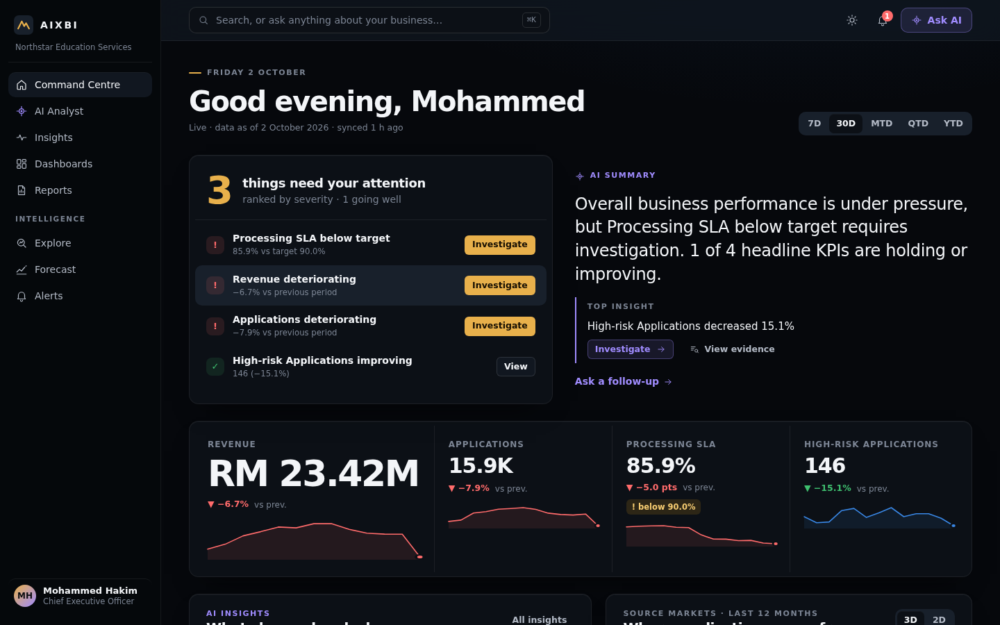
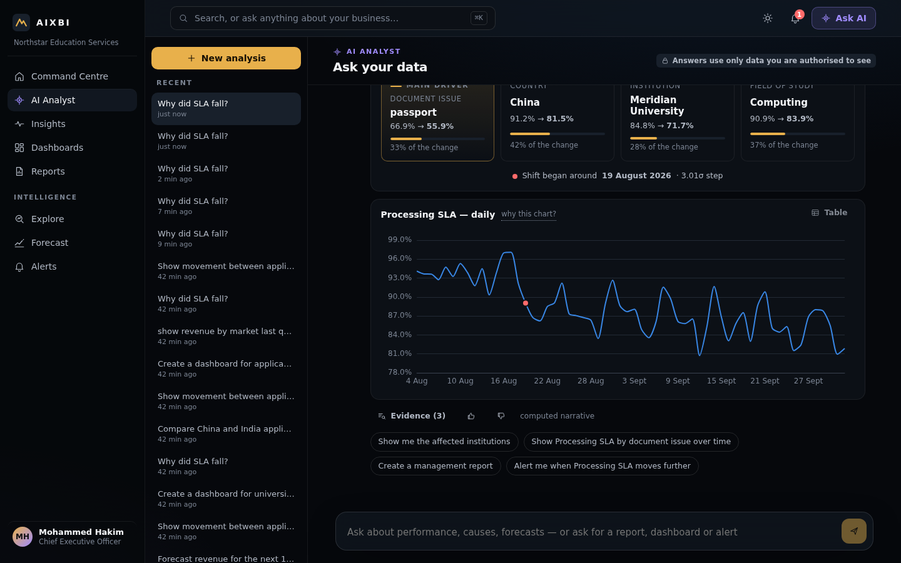
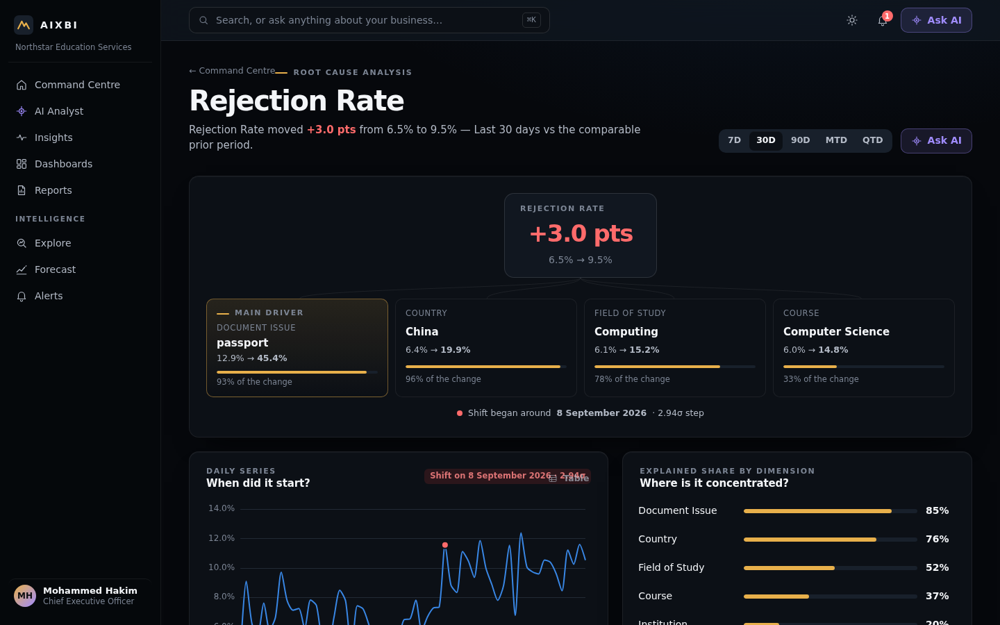
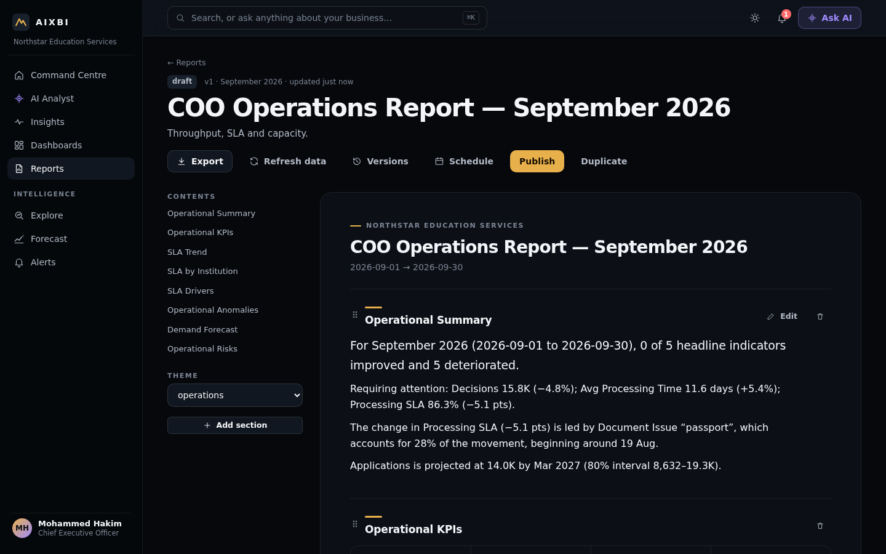
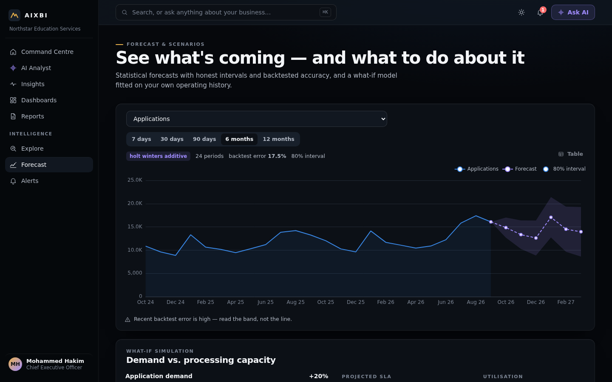
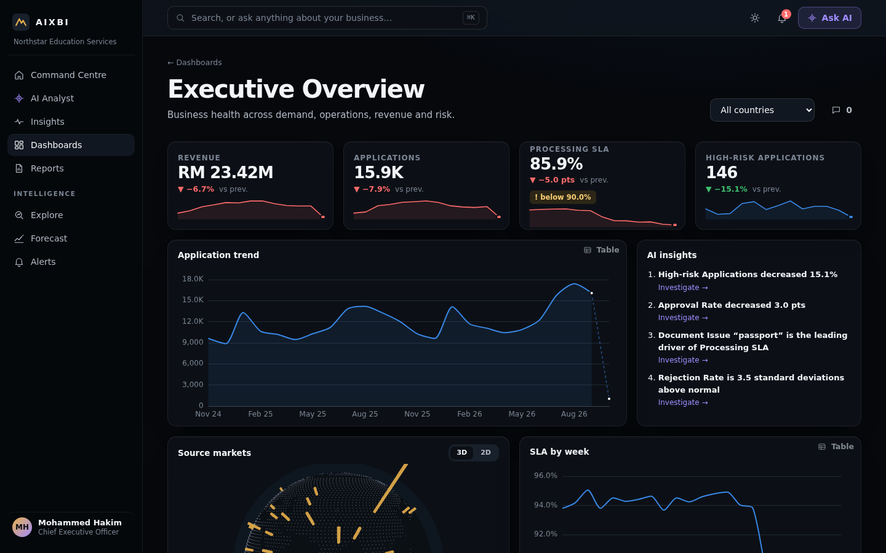
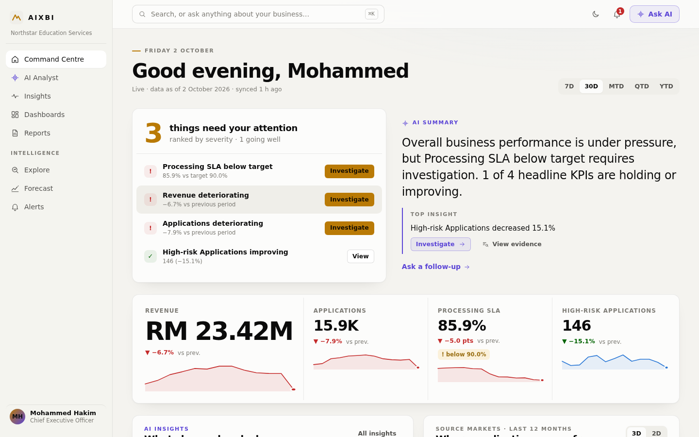

# AIXBI — AI Enterprise Intelligence Platform

An AI-native BI platform. You ask a business question; a governed AI analyst plans it against a semantic model, runs it under your permissions, and returns an evidence-backed answer. Every number in that answer can be traced to the query that produced it.



| | |
|---|---|
|  |  |
|  |  |
|  |  |

## What's inside

- **Semantic layer:** governed metrics, dimensions and relationships, plus a query compiler. The compiler uses parameterised SQL, joins through the relationship graph, applies row- and column-level security, and runs every query in a read-only transaction with timeouts. Results are cached and audited.
- **AI analyst:** a LangGraph pipeline (semantic → intent → governance → execute → visualise → narrate). It works with a deterministic planner, or with a Claude planner when an API key is set; the Claude plan is validated against the catalog. A number-grounding guard checks the narrative, and progress streams to the UI over SSE. The AI never writes free SQL; it calls the API as the signed-in user.
- **Intelligence:**
  - Automated insights and anomaly detection (seasonal residuals).
  - Root-cause decomposition (leave-one-out, excess impact, onset detection).
  - Holt-Winters forecasting with backtested intervals.
  - What-if scenarios.
- **Reports:** computed documents with versions and diffs. Exports to PDF, PPTX, Excel, CSV and HTML. Schedules and distribution.
- **Dashboards:** responsive reflow, drag and resize editing, a 3D globe, maps and ECharts.
- **Alerts and push intelligence:** threshold and anomaly alerts, delivered as in-app notifications over SSE.
- **Data platform:** connectors, file upload ingestion, profiling and generated semantic models.
- **Security:**
  - Multi-tenancy that fails closed.
  - JWT with rotating refresh tokens and reuse detection, plus TOTP MFA.
  - RBAC, ABAC row-level security, and column masking.
  - Append-only audit log.
  - AI governance: a model registry, run traces, and optional Langfuse.
- **Design system "Signal":** designed dark and light themes, a validated colour-blind-safe chart palette, table views for every chart, and contextual loading, empty and error states.

## Repository map

| Path | What |
|---|---|
| `apps/api` | Laravel 13 / PHP 8.3 API: tenancy, auth, semantic query engine, analytics, reporting, alerts, ingestion, governance |
| `services/ai` | Python FastAPI + LangGraph AI analyst, forecasting and anomaly engine |
| `apps/web` | Angular 20 (zoneless, signals) web app |
| `infra/` | Dockerfiles, nginx gateway, Kubernetes manifests, k6 load test |
| `docs/` | Architecture, ERD, API, AI, design, operations, roadmap, ADRs |
| `tests/e2e` | Playwright smoke test of the full journey |

## Quickstart

With Docker:

```bash
docker compose up --build
docker compose run --rm api php artisan migrate --seed --force
open http://localhost:8080
```

To run without containers, see [docs/OPERATIONS.md](docs/OPERATIONS.md). Set `ANTHROPIC_API_KEY` in the AI service to enable the Claude planner and narrator. Without it, the deterministic planner answers the same questions.

## Demo personas

Every persona uses the password `Demo@2026!`.

| Email | Role | Experience |
|---|---|---|
| `ceo@northstar.demo` | CEO | Executive command centre |
| `coo@northstar.demo` | Executive | Operations focus |
| `manager.asia@northstar.demo` | Manager | Row-level security: Asian markets only |
| `analyst@northstar.demo` | Analyst | Explore, AI, reports |
| `engineer@northstar.demo` | Data engineer | Data platform, semantic model |
| `admin@northstar.demo` | Tenant admin | Administration, governance |
| `viewer@northstar.demo` | Viewer | Read-only |

**Demo journey** (as the CEO), typed into the AI Analyst:

1. "How are we doing this quarter?"
2. "Why is SLA compliance down?"
3. "Which institutions are affected?"
4. "Create a report", then "add a forecast" and "make it executive"
5. "Alert me if it drops below 85%"
6. "What if utilisation falls 10%?"

The seeded data contains a real SLA squeeze at three strained institutions and a rejection-rate anomaly, so the answers are computed rather than scripted.

## Tests

| Suite | Command | Status |
|---|---|---|
| API (PostgreSQL) | `cd apps/api && php artisan test` | 60 passing |
| AI service | `cd services/ai && python -m pytest -q` | 25 passing |
| Web unit | `cd apps/web && npx ng test --watch=false` | 7 passing |
| E2E smoke | `cd tests/e2e && npm i && node smoke.mjs` (stack running) | 7 steps passing |

## Documentation

[Architecture](docs/ARCHITECTURE.md) · [ERD](docs/ERD.md) · [API](docs/API.md) · [AI](docs/AI.md) · [Design](docs/DESIGN.md) · [Operations](docs/OPERATIONS.md) · [Roadmap](docs/ROADMAP.md) · [ADRs](docs/adr)
