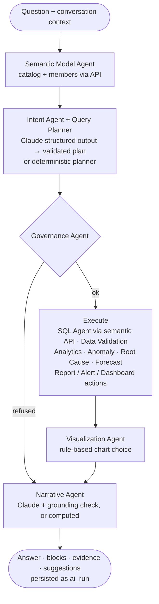

# AI architecture

## The analyst graph (LangGraph)

Each node appends a trace step (`agent`, `label`, `status`, `detail`, `ms`) which streams to the UI and is stored with the run.

## Intents

`overview · trend · breakdown (incl. comparisons, rankings, "affected X") · why · forecast · what_if · report · report_edit · alert · dashboard · anomalies · help`. Follow-ups use the conversation context (`metrics`, `dimension`, `range`, `report_id`), e.g. *“Show me the affected institutions”* after *“Why did SLA fall?”*.

## Planners

* **Claude planner** (when `ANTHROPIC_API_KEY` is set): `claude-opus-5-5`, effort `low`, structured output into `LlmPlan`, catalog in a cached system prompt, server-side refusal fallbacks enabled. The plan is **validated against the catalog** — unknown metrics reject the plan, unknown dimensions/filters are dropped — then compiled by the API.
* **Deterministic planner** (default without a key, and the fallback): intent rules, catalog labels/synonyms (longest match, KPI tie-break), live dimension members, business time phrases (“last quarter”, “in September”), thresholds (“below 90%” → 0.9 for percent metrics), scenario percentages.

## Grounding

The narrative model only receives facts computed by the platform. `grounded()` extracts every number in its output and requires each to appear in the facts (signs and units normalised; years and small ordinals allowed). Otherwise the deterministic narrative is used and the run records why. Unanswerable questions are refused rather than guessed.

## Evidence

Every block carries query hashes; the run stores an evidence list (semantic query, SQL for authorised roles, period, row count, cache status). The UI's **Evidence** drawer shows it; Governance → AI usage reports the share of runs grounded in evidence.

## Statistical engine

* **Forecast**: Holt-Winters additive with damped trend when ≥ 2 seasons exist, damped Holt otherwise; complete periods only; 80% intervals widen with √h and use the larger of in-sample σ and hold-out RMSE; MAPE backtest reported; ratios clipped to [0, 1].
* **Anomalies**: seasonal median baseline (same weekday, trailing 8 cycles) with MAD scale (floored), no look-ahead, ≥ 21 residuals before judging; |z| ≥ 3 flagged; severities 3 / 3.5 / 4.5σ.
* **Root cause** (API): leave-one-out counterfactual attribution, excess-impact ranking, change-point onset.
* **What-if** (API): OLS of weekly SLA on utilisation two weeks earlier, anchored at today's observed SLA; extrapolation and low-R² caveats.

## Governance

`ai_runs` (question, intent, planner, model, trace, evidence, tokens, cost, latency, status), `ai_feedback`, `model_registry`, `prompts`, `ai_agents`. Langfuse tracing activates when `LANGFUSE_PUBLIC_KEY`/`LANGFUSE_SECRET_KEY` are set.

## Evaluation

`services/ai/tests` run the full graph against a mocked API (deterministic answers for deterministic calculations), validate LLM plan handling and the grounding guard, and test forecasting/anomaly maths. The API suite checks KPI values against hand-written SQL and that root-cause impacts sum exactly to the total change for additive metrics.
