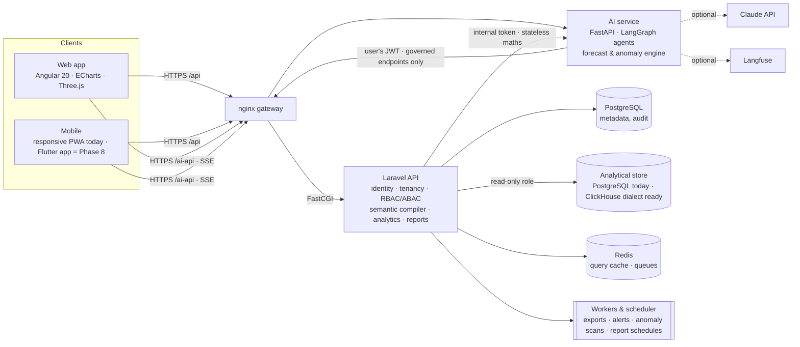

# AIXBI — Architecture

AIXBI is an AI-native enterprise intelligence platform. People and AI agents ask questions of the same **governed semantic layer**; every number shown, written or spoken can be traced to the query that produced it.



## Components

| Component | Responsibility | Key code |
|---|---|---|
| **API** (`apps/api`, Laravel 13 / PHP 8.3) | Auth (JWT access + rotating refresh, TOTP MFA), multi-tenancy, RBAC + ABAC, semantic layer, query compiler/executor, KPI/root-cause/scenario analytics, insights, dashboards, reports & exports, alerts, notifications, ingestion, governance, admin | `app/Domain/*`, `app/Http/Controllers/Api/*`, `routes/api.php` |
| **AI service** (`services/ai`, Python 3.11) | LangGraph analyst pipeline, deterministic + Claude planners, grounded narrative, Holt-Winters forecasting, seasonal robust anomaly detection, SSE streaming | `app/agents/*`, `app/analytics/*`, `app/main.py` |
| **Web** (`apps/web`, Angular 20 zoneless) | Command centre, AI analyst, investigate, explore, dashboards (12/8/4-column reflow), reports, forecast & what-if, data, semantic, governance, admin | `src/app/features/*`, `src/app/shared/*` |
| **Infra** (`infra/`, `docker-compose.yml`) | Container images, nginx gateway, Kubernetes baseline, CI | |

## The semantic layer is the contract

Nothing — not the UI, not the AI — writes SQL. Callers send a **semantic query**:

```json
{ "model": "decisions", "metrics": ["sla_compliance"], "dimensions": ["institution"],
  "filters": [{ "dimension": "country", "op": "in", "value": ["China"] }],
  "time": { "range": "last_30_days", "grain": "week" }, "sort": [{ "key": "sla_compliance", "dir": "asc" }], "limit": 10 }
```

`QueryCompiler` turns it into parameterised SQL with these guarantees:

1. Only identifiers declared in the model reach SQL, always quoted; field existence is re-checked against the dataset.
2. Every user value is a bound parameter. Metric expressions are parsed by a recursive-descent parser that accepts only measure keys, numbers and `+ − × ÷ ( )`.
3. Joins are resolved from declared many-to-one relationships (BFS from the fact table) — no fan-out joins.
4. **Row-level security** predicates (user attribute → dimension) are always ANDed in; a missing attribute means *no rows*, never all rows.
5. **Column-level security**: sensitive dimensions require `data.sensitive`.
6. One read-only `SELECT`, `LIMIT n+1` (to report truncation honestly), executed in a `READ ONLY` transaction with `statement_timeout`, on a database role that only has `SELECT` on the analytics schema.
7. Results are cached in Redis keyed by SQL + bindings + a **security fingerprint**, so users with different access never share cache entries. Every execution (cached or not) is audited with its query hash.

Time is first-class: `TimeRange` resolves business periods and their comparable prior periods (month-to-date compares with the same days of last month), and results flag the **in-progress bucket** (`partial_from`) so no chart ever shows a half-month as a collapse.

## Multi-tenancy

Every tenant-owned table has `organisation_id`. The `BelongsToOrganisation` trait adds a global scope that **fails closed**: inside a request with no resolved tenant it matches nothing. Child tables (fields, widgets, sections) are only reachable through their tenant-scoped parent. Platform paths that must cross tenants (login lookup, seeding, schedulers) use the explicit, greppable `TenantScopeBypass::run()`. Background jobs run *as a principal* of the tenant (rule owner, tenant admin) so RLS still applies.

## Key flows

**AI question** — browser → `/ai-api/v1/chat/stream` (user JWT) → LangGraph: *semantic* (catalog via API) → *intent/planner* (Claude structured output, validated against the catalog; deterministic planner otherwise) → *governance* → *execute* (governed API calls: `/kpis`, `/query`, `/analysis/root-cause`, `/analysis/forecast`, `/reports/generate`, `/alert-rules` …) → *visualization* → *narrative* (Claude, number-grounding check; deterministic otherwise) → persisted via `/ai/runs` with trace, evidence, tokens and cost. Steps and blocks stream as SSE events.

**Root cause** — leave-one-out counterfactual decomposition over additive components (averages decomposed into sum ÷ count), ranked by *excess impact* (impact beyond volume share), plus change-point onset detection on the daily series.

**Reports** — template blueprints → `ReportBuilder` computes each section from governed queries (KPIs, trends, breakdowns, anomalies, root cause, forecast), then writes the summary and risks *from the computed facts*. Versions are immutable snapshots (publish, compare, restore). Exporters: PDF (dompdf + server-rendered SVG charts), PPTX (native editable charts), XLSX (one sheet per section + provenance), CSV, standalone HTML.

**Alerts & push intelligence** — the evaluator runs each rule *as its owner*, fires once per breach, and the message includes the value and the leading driver: “Processing SLA dropped to 85.9%, mainly due to Institution Meridian University.”

## Performance strategy

Columnar-ready dialect abstraction (PostgreSQL today, ClickHouse SQL generation implemented), parameterised queries, Redis result cache (300 s, security-scoped), batched KPI queries per model, lazy-loaded web routes (81 kB gzipped initial), background exports, SSE streaming so AI answers start immediately. Measured locally on the 290k-row demo (PHP built-in dev server, no tuning): grouped semantic queries execute in 30–120 ms in the database; a cached request completes end-to-end in ~65 ms; the full home briefing (4 KPIs × 3 queries, insights, attention ranking) returns in ~130 ms warm. Production numbers depend on php-fpm/Octane and the analytical engine.

See `docs/adr/` for the decisions behind these choices.
