# Data model (metadata database)

All primary keys are UUID v7 (time-ordered). Tenant-owned tables carry `organisation_id` and are isolated by a fail-closed global scope. Migrations: `apps/api/database/migrations`.

```mermaid
erDiagram
  organisations ||--o{ departments : has
  organisations ||--o{ teams : has
  organisations ||--o{ users : employs
  users }o--o{ roles : user_roles
  roles }o--o{ permissions : role_permissions
  users ||--o{ refresh_tokens : sessions

  organisations ||--o{ data_sources : connects
  data_connectors ||--o{ data_sources : "type of"
  data_sources ||--o{ ingestion_runs : runs
  data_sources ||--o{ datasets : produces
  datasets ||--o{ dataset_fields : has

  organisations ||--o{ semantic_models : defines
  datasets ||--o{ semantic_models : "base fact"
  semantic_models ||--o{ dimensions : has
  semantic_models ||--o{ measures : has
  semantic_models ||--o{ metrics : has
  semantic_models ||--o{ relationships : joins
  semantic_models ||--o{ hierarchies : "drill paths"
  semantic_models ||--o{ row_level_policies : secures
  semantic_models ||--o{ business_rules : documents
  organisations ||--o{ data_lineage : traces

  organisations ||--o{ dashboards : owns
  dashboards ||--o{ dashboard_widgets : contains
  organisations ||--o{ visualisations : saves
  dashboards ||--o{ filters : "saved views"

  report_templates ||--o{ reports : instantiates
  reports ||--o{ report_sections : contains
  reports ||--o{ report_versions : snapshots
  reports ||--o{ report_exports : renders
  reports ||--o{ scheduled_reports : schedules

  semantic_models ||--o{ alert_rules : watches
  alert_rules ||--o{ alerts : fires
  users ||--o{ notifications : receives
  organisations ||--o{ insights : generates
  organisations ||--o{ anomalies : detects
  organisations ||--o{ forecasts : projects
  organisations ||--o{ scenarios : simulates

  users ||--o{ ai_conversations : has
  ai_conversations ||--o{ ai_messages : contains
  ai_conversations ||--o{ ai_runs : executes
  ai_runs ||--o{ ai_feedback : rated
  model_registry }o--o{ ai_runs : "used by"
  ai_agents ||..|| prompts : configured

  users ||--o{ comments : writes
  users ||--o{ bookmarks : favourites
  organisations ||--o{ audit_logs : records
  organisations ||--o{ feature_flags : toggles
```

## Analytical store (`analytics` schema, demo tenant)

| Table | Grain | Notes |
|---|---|---|
| `applications` | one row per student application | outcome, stage, processing days, SLA, risk, document issue, visa/medical status, `applicant_ref` (sensitive) |
| `payments` | one row per fee payment | application / visa / medical fees |
| `countries`, `institutions`, `courses` | dimensions | coordinates, region, field, level |
| `processing_capacity` | day | officers and theoretical capacity |
| `attendance_monthly` | institution × month | enrolment, attendance rate |
| `ds_<org>_<name>` | uploaded / ingested | created by the ingestion framework |

Semantic models over it: **Application Intake** (by submission date), **Application Decisions** (by decision date — avoids survivorship bias in SLA and rejection metrics), **Revenue** (by payment date), **Processing Capacity**. Definitions: `apps/api/database/seeders/semantic/*.json`.
